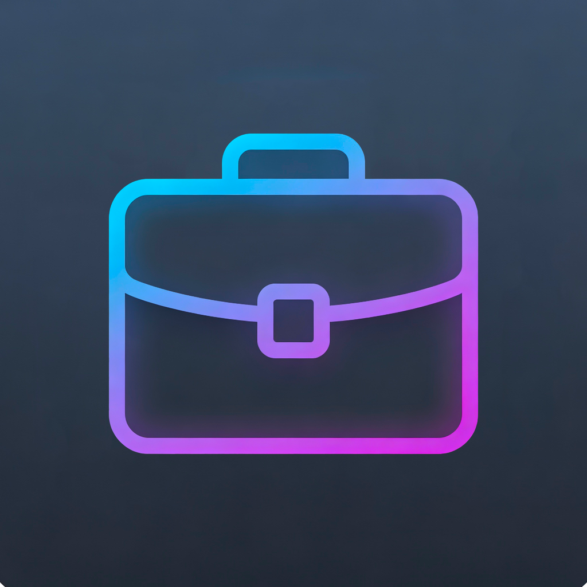
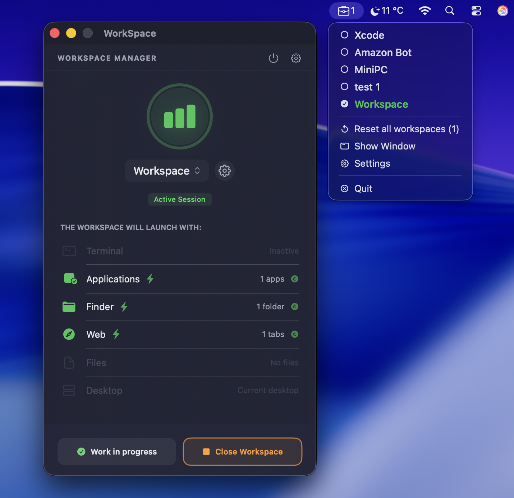

<p align="center">
  
</p>

<h1 align="center">WorkSpace Manager for macOS</h1>

<p align="center">
  <strong>Versione 1.2.0</strong> • Automazione workspace per sviluppatori e freelance<br/>
  Terminale, cartelle, app e siti web aperti in <strong>un click</strong>.
</p>

<p align="center">
  <a href="https://frafra077.github.io/workspace-manager/"><b>🌐 Sito ufficiale & Screenshot</b></a> •
  <a href="https://github.com/frafra077/workspace-manager/releases/latest"><b>📦 Download v1.2 (.dmg)</b></a>
</p>

<p align="center">
  <a href="https://buymeacoffee.com/fra07">
    
  </a>
</p>

> [!IMPORTANT]
> **Aggiornamento Critico v1.2:**
> Se stai usando una versione precedente, **aggiorna ora**.
> La versione 1.2 introduce il nuovo motore di aggiornamenti necessario per ricevere le future funzionalità e patch di sicurezza.

---

## 🎉 Novità v1.2.0

| 🚀 **Motore Update** | 🌍 **Multilingua** | 🌗 **Temi** | 💾 **Backup** |
|---|---|---|---|
| Auto-Check Versioni | Italiano 🇮🇹 / English 🇬🇧 | Light/Dark/System | Esporta/Importa JSON |

| 🔄 **Smart Relaunch** | ⭐ **Preferito** | 📖 **Onboarding** | 🗑️ **Reset** |
|---|---|---|---|
| Riapri elementi singoli | Workspace default | Guida interattiva | Pulizia totale |

---

## Anteprima

<p align="center">
  
</p>

---

## Caratteristiche principali

✅ **Automazione Completa**  
Terminale con venv/script già attivi, Finder, app e siti web in workspace dedicato.

✅ **Menu Bar Resident 2.0**  
Controllo granulare: scegli cosa avvia automaticamente, cosa manualmente.

✅ **100% SwiftUI Nativo**  
Leggerissimo (~15MB RAM), senza Electron, look nativo macOS.

✅ **Smart Relaunch**  
Hai chiuso una cartella per sbaglio? Clicca l'icona per riaprirla sola.

✅ **Backup & Restore**  
Esporta i tuoi workspace in JSON, ripristinali ovunque.

✅ **Personalizzazione Totale**  
Temi (Light/Dark/System), shortcuts globali, workspace preferito ⭐.

---

## 📦 Installazione

1. **Scarica** `WorkSpace.1.2.dmg` dalla [Release](https://github.com/frafra077/workspace-manager/releases/latest)
2. **Trascina** l'app in `/Applicazioni`
3. **Prima volta**: Tasto destro → "Apri" (bypassa Gatekeeper)
4. **Aggiornamento**: Sostituisci l'app vecchia (i workspace sono preservati!)

---

## 🌐 Multilingua

- **Italiano 🇮🇹** (predefinito)
- **English 🇬🇧** (selezionabile dalle impostazioni)

---

## Feedback & Supporto

- 🐞 **Bug Report**: [Apri Issue](https://github.com/frafra077/workspace-manager/issues)
- ☕ **Supportami**: [Buy Me a Coffee](https://buymeacoffee.com/fra07)


---

## 📱 Requisiti

- macOS **Sonoma 14.0** o superiore
- Architettura **Universal** (Intel + Apple Silicon)

---

<div align="center">
 
  
  
</div>

---

⭐ **Star this repo if you find it useful!**

## 👨‍💻 Codice SwiftUI (Anteprima)

```swift
struct WorkspaceItemView: View {
    let workspace: WorkspaceModel
    
    var body: some View {
        HStack {
            Image(systemName: workspace.icon)
                .foregroundStyle(.blue)
                .font(.title2)
            
            VStack(alignment: .leading) {
                Text(workspace.name)
                    .font(.headline)
                Text("$$workspace.items.count) elementi")
                    .font(.caption)
                    .foregroundStyle(.secondary)
            }
            
            Spacer()
            
            Button("Avvia") {
                launchWorkspace(workspace)
            }
            .buttonStyle(.borderedProminent)
        }
        .padding()
        .glassBackgroundEffect()
    }
}

